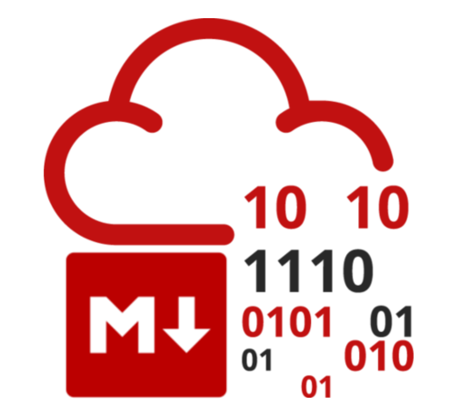

# thm2md
<p align="center">
  
</p>

[](https://github.com/sky9262/thm2md/)

<br>


## Requirments

- python3

## Installation
```bash
sudo bash install.sh
```

## Setup
```bash
thm2md --setup
```
Enter your `name` and `connect.sid` cookie to access subscriber-only rooms

## Help
```bash
thm2md --help
```
or
```bash
thm2md -h
```

## Usage

```bash
thm2md [room_name] [Path To Save]
```

Example:
```bash
thm2md shodan ~/Desktop
```


<br>

# You can see the output [shodan.md](shodan.md)

<br>

## 🔗 Connect with me
[](https://sky9262.tistory.com/)
[](https://www.linkedin.com/in/sky9262/)
[](https://github.com/sky9262/)
